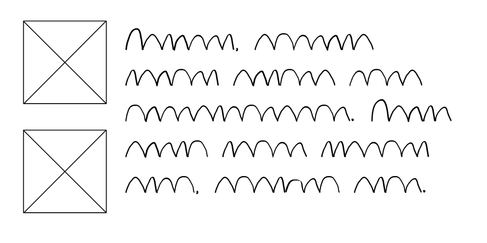
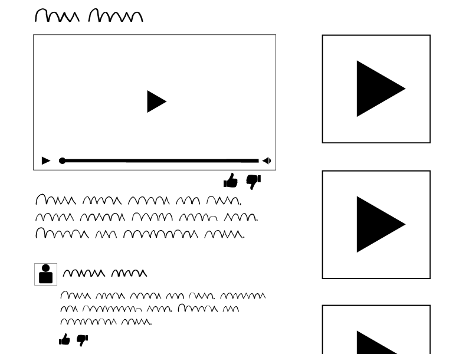

<h1 align="center"> Scribble Font for Prototyping & Wireframing  </h1>

 Make Wireframes Great Again 

Demo1:

Demo2: 

 Scribble is replacment for Lorem Ipsum Text and works great with low fidelity wireframes. 

 The font Scribble.ttf can be found in the font folder.

You can test the demo here: https://vladocar.github.io/Scribble-Font/

CDN:

https://unpkg.com/scribble-font@1.0.0/scribble-webfont.woff

https://unpkg.com/scribble-font@1.0.0/scribble-webfont.woff2

https://unpkg.com/scribble-font@1.0.0/font/Scribble.ttf

Find more similar fonts here: https://www.designinspiration.info/free-fonts-for-lo-fi-wireframing/

<h3>License</h3>

This project is licensed under the MIT License
